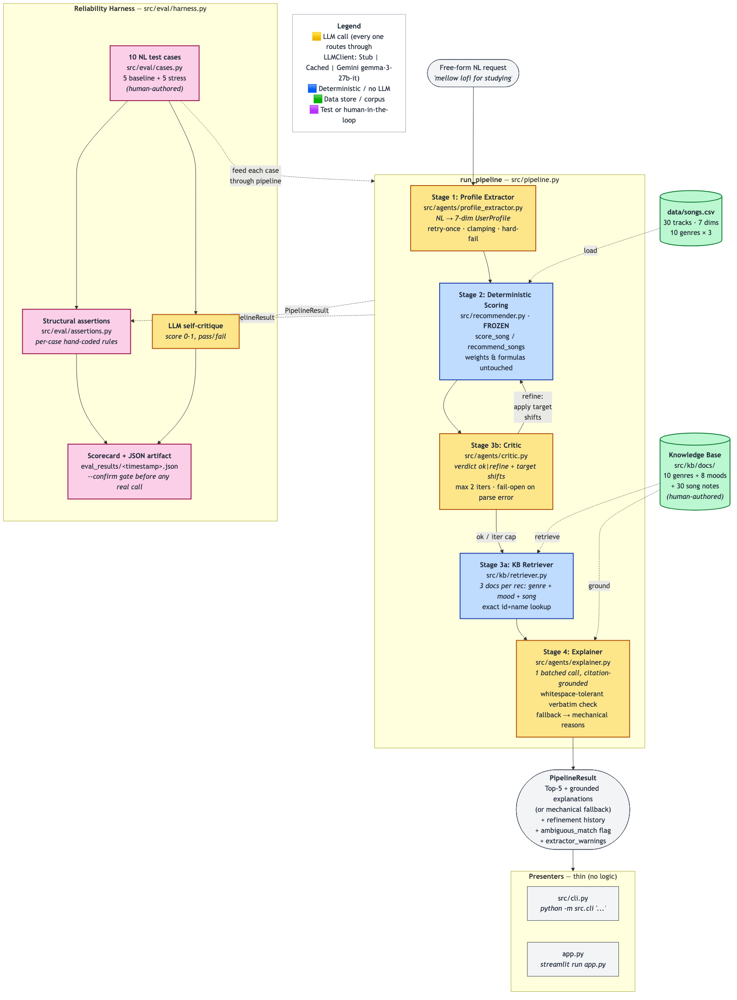

# 🎵 Applied AI Music Recommender

## Project Summary

SongFinder 9001 helps a listener find songs that match a vibe they
describe in their own words. The listener answers three short
questions about what they're doing, what kind of sound they're
after, and any genres they want or want to avoid, or just types a
free-form description, and the system saves it as a named Vibe
Profile they can come back to across sessions. When the listener
picks a profile, the system scores a 30-track catalog against it
and recommends a handful of songs, with a short LLM-written
paragraph per pick that grounds every claim in verbatim quotes
from a hand-authored knowledge base.

This is the AI110 final project, an extension of the Module 3 Music
Recommender Simulation. Module 3 was a deterministic content-based
recommender: hand-coded profile dicts ranked against a CSV catalog
by summing seven weighted feature similarities, with a short reason
breakdown printed in the terminal. SongFinder 9001 keeps that
scoring core unchanged and layers an AI-assisted profile builder,
RAG-grounded explanations, persistent profiles, and a reliability
harness on top of it. The interface is a 4-tab Streamlit app
(Song Finder, Build Vibe Profile, My Profiles, Reliability) plus a
CLI.



🎥 **Video walkthrough:** [Watch on Loom](https://www.loom.com/share/1d0925a7d75342cb8b1d78569ecf9723)

---

## What's New

- **AI-assisted profile creation.** The listener answers three short
  questions plus a free-form description. An API call to Gemini
  turns that into a structured profile (7 numeric/categorical fields
  plus an `avoid_genres` list), and a second API call fact-checks
  the result against what the listener said and applies corrections
  if needed. The avoid list isn't cosmetic: the scorer hard-zeros
  songs in those genres so they can't land in the top-`k`.
- **Persistent profiles.** Saved as JSON, alongside five immutable
  in-code presets. The listener can save multiple, edit them
  field-by-field with sliders and a multi-select for avoided
  genres, and switch between them across sessions.
- **RAG-grounded explanations.** Every recommendation comes with a
  short paragraph generated by the LLM that has to quote verbatim
  from a hand-authored KB of 48 docs. A substring check verifies
  each quote is real before display; fabricated citations fall back
  to the mechanical point breakdown.
- **4-tab Streamlit UI** branded **SongFinder 9001**: Song Finder,
  Build Vibe Profile, My Profiles, Reliability. The Reliability tab
  surfaces past test runs, lets you preview cost before issuing real
  API calls, and runs a fresh test on demand. No CLI required.
- **Reliability harness with two scorecards.** Build-eval and
  recommend-eval, both gated by `--confirm` so dry runs never spend
  API credits.

---

## How The System Works

The system splits into two pipelines with different lifetimes. Build
runs rarely and deliberately. Recommend runs anytime, against any
saved profile or preset.

All LLM access goes through a single shared client wrapping the
Gemini API; what varies between steps is the prompt and the
response handling, not the model. Each call below is an HTTP request
to that one model with a different system prompt.

### Build pipeline

The listener fills any subset of three short questions plus an
optional free-form description. Anything blank gets dropped before
any request goes out. If every field is blank the build refuses
immediately with a clear error rather than spending an API call on
nothing.

The non-blank fields are wrapped in an extraction prompt and sent
to the model in a single API call. The response comes back as JSON
and is parsed into a structured profile: a favorite genre, a
favorite mood, five numeric targets (energy, tempo, valence,
danceability, acousticness), an `avoid_genres` list, and a short
suggested name for the profile (used if the listener didn't supply
one). Anything the model emits is sanity-checked at the boundary.
Unknown genres or moods fall back to the nearest allowed value,
numerics are clamped into range, and the favorite genre is never
allowed to also appear in the avoid list. Each fix surfaces as a
warning the listener sees in the result.

A second API call follows with a different prompt. This one asks
the model to fact-check the profile against the listener's inputs
and decide whether the profile faithfully encodes what they said.
If not, the response carries specific corrections (e.g.
"target_tempo_bpm should be 90, not 120"). The build applies them
and runs the fact-check API call again. The loop is capped at two
rounds. If the model still isn't satisfied after the second round,
the result is flagged ambiguous and the last candidate is kept.
Parse errors and API glitches degrade to "looks good" so a
misbehaving fact-check never blocks the build.

The result carries the final candidate profile, the original
unrefined extraction, the round-by-round history of what changed,
the ambiguous flag, the suggested name from the extractor, and any
boundary-check warnings. If the listener gave the profile a name
(or left it blank, in which case the extractor's suggested name is
used), it's saved to disk as JSON. A collision with an existing
profile prompts the listener to overwrite or rename before saving.

### Recommend pipeline

Given a profile, the scorer ranks every song in the 30-track
catalog and returns the top-`k`. Each pick comes back with the
exact point breakdown that earned it that score (e.g. `+3.5 genre
match`, `+2.30 energy similarity`), so a surprising result is
always auditable from the math alone.

For each pick, the system pulls three editorial documents from a
hand-authored knowledge base: the relevant genre overview, the
relevant mood overview, and a per-song note. A single API call
then sends all the picks plus their KB context to the model in
one batched request, asking for a short paragraph per song that
explains why it fits the listener's profile. The prompt requires
the model to quote verbatim phrases from the docs it was shown,
and a substring check confirms each quoted phrase actually appears
before the explanation is displayed. If the model paraphrased
instead of quoting, the prose drops out and only the point
breakdown is shown. Every recommendation ships with a
justification: grounded prose plus the breakdown when the model
quotes correctly, or the breakdown alone when it doesn't.

### The scorer

`src/recommender.py` is the deterministic scoring core. Genre and
mood are labels: an exact match earns the full bonus, an adjacent
genre (per a fixed map of related genres like rock ↔ acoustic, lofi
↔ ambient) earns 50% credit, no match earns zero. The five numeric
features earn partial credit by closeness, with tempo scaled by a
60 BPM range. Weights: genre 3.5, mood 2.0, energy 2.5, tempo 2.0,
valence 2.0, acousticness 1.5, danceability 1.5.

If a song's genre is in the listener's `avoid_genres` list, the
scorer short-circuits at the top of `score_song`, returning
`(0.0, ["avoided genre: <name>"])` before any other math runs.
Avoid means avoid: an avoided-genre song never appears in the
top-`k` regardless of how well it matches on energy or tempo.

---

## Getting Started

### Prerequisites

- Python 3.11+ 
- A free Gemini API key from
  [Google AI Studio](https://aistudio.google.com/app/apikey). The app
  runs in stub mode without one, but the build pipeline and grounded
  explanations both need an LLM, so you'll want a key for any real
  use.

### Setup

```bash
git clone https://github.com/codyholm/applied-ai-systems.git
cd applied-ai-systems

python -m venv .venv
source .venv/bin/activate          # macOS / Linux
# .venv\Scripts\activate           # Windows

pip install -r requirements.txt

echo "GEMINI_API_KEY=your-key-here" > .env
```

### Running the Streamlit UI

```bash
streamlit run app.py
```

Four tabs:

- **Song Finder** picks a saved profile or preset and shows the
  top-`k`, each with a fact-checked LLM explanation and a mechanical
  point breakdown.
- **Build Vibe Profile** takes the three questions plus a free-form
  description and optionally saves the result, with a stepwise
  pipeline trace ("Self-check rounds") so you can see what the
  extractor and critic did.
- **My Profiles** is list / show / edit / delete with sliders for
  numeric fields and a multi-select for `avoid_genres`. Presets show
  up here read-only.
- **Reliability** previews API cost (dry-run audit), loads past
  test-run JSON artifacts, runs a fresh test live (gated by a
  confirmation), and runs the unit-test suite via pytest.

### Running the CLI

```bash
# Build a profile from a description and save it
python -m src.cli build --description "calm acoustic for late-night focus" --save night-study

# Or use the full three-question form
python -m src.cli build \
  --activity "studying late at night" \
  --instruments "warm acoustic instruments" \
  --description "Quiet, headphones-on stuff with a vinyl warmth, calm and focused" \
  --save night-study

# Recommend against a saved profile or a preset
python -m src.cli recommend --profile night-study
python -m src.cli recommend --preset chill_lofi -k 3

# Manage profiles
python -m src.cli profiles list
python -m src.cli profiles show night-study
python -m src.cli profiles edit night-study           # interactive
python -m src.cli profiles delete night-study --force
```

### Running the eval harness

```bash
# Dry-run audit. No API calls. Prints estimated quota cost.
python -m src.eval.harness

# Real run. Gated by --confirm. Writes a JSON artifact.
python -m src.eval.harness --confirm
```

### Running the tests

```bash
pytest -q       # 99 tests, all offline (StubLLMClient)
```

---

## Sample Interactions

### Build a profile from a single description

```text
$ python -m src.cli build --description "Quiet acoustic piano with vinyl warmth" --save night-study

Extracted profile:
  favorite_genre:       acoustic
  favorite_mood:        chill
  target_energy:        0.30
  target_tempo_bpm:     70.0
  ...

Refinement summary: iter 0: ok
Saved profile 'night-study' -> profiles/night-study.json
```

### Recommend against the saved profile

```text
$ python -m src.cli recommend --profile night-study -k 3

Recommendations for night-study:

1. Porchlight Letters - June Maple
   Given your preference for acoustic music and chill moods,
   "Porchlight Letters" is a strong match. The song is firmly within
   the acoustic genre, as it centers on "fingerpicked steel-string
   guitar and a single voice carrying the melody — no drums, no
   electric instruments, no production tricks." It also aligns with
   your desired mood, combining "low energy with low valence."
   - genre match
   - mood match
   - energy / tempo / acousticness / valence / danceability similarity

2. Library Rain - Paper Lanterns
   ...
```

Mechanical reasons are always shown. If the LLM fabricates a
citation, the prose drops out and the mechanical reasons stand alone.

### Build with explicit avoid-genres

```text
$ python -m src.cli build \
    --activity "slow weekend mornings, making coffee" \
    --instruments "fingerpicked acoustic guitar, soft vocals" \
    --genres "acoustic, definitely no electronic or synthwave" \
    --description "Quiet, warm acoustic for slow mornings — fingerpicked guitar, gentle vocals, vinyl warmth, no drums. Please avoid anything electronic or synthwave; I want it to feel unplugged."

Extracted profile:
  favorite_genre:       acoustic
  favorite_mood:        relaxed
  target_energy:        0.30
  target_tempo_bpm:     80.0
  ...
  avoid_genres:         electronic, synthwave

Refinement summary: iter 0: ok
```

Every electronic and synthwave track is hard-zeroed in
`recommend_songs`, so they never appear in the top-`k` even when
their numeric features match. Mechanical reasons explicitly say
`avoided genre: <name>` for the zeroed picks.

---

## Design Decisions

A few choices worth calling out, because they shaped how the rest of
the project came together.

Two pipelines, not one. The first sketch had one
`run_pipeline(nl) -> result` that extracted a profile, scored,
retrieved, explained, and discarded the profile. That collapsed two
different lifetimes into one call. Profile creation is a deliberate
AI-assisted step that should produce a persistent object;
recommending is a fast, frequent operation against any saved or
preset profile. Splitting them makes the recommend path quota-cheap
(one batched explainer call, no extractor or critic) and matches how
a listener actually thinks about it.

Critic asks about faithfulness, not quality. Earlier versions asked
the critic "do these top-5 match what the listener wanted?" That's a
vague question with no clean pass/fail. The new critic asks per
field: "does this profile encode what the listener said?" with
concrete heuristics (if the listener said "mellow", `target_energy`
should be in `[0.20, 0.40]`). It defaults to `ok` and reserves
`refine` for plain mismatches with a specific corrected value.

RAG with verbatim citations and a fabrication fallback. The
explainer prompt requires the model to quote 1–3 verbatim phrases
from the retrieved KB doc for that specific song. A whitespace and
case tolerant substring check verifies each citation actually exists
in the doc the LLM was shown. If the model paraphrased instead of
quoting, the explanation falls back to mechanical reasons only. This
caught real fabrications during eval (about 4 of 10 cases) while
still producing a useful output for every recommendation.

Frozen scorer during the AI layer, audited and tuned after. I held
`src/recommender.py` immutable while building the LLM components so
I wasn't tuning weights when the actual graded work was the AI
layer. Once that landed I audited the scorer, ran a sweep, and
made three changes: bumped genre weight, tightened the tempo range,
and added genre adjacency. A later pass added `avoid_genres` as a
hard-zero gate at the top of `score_song`, so the build form's
"any genres to avoid" question now has somewhere for its answer to
land.

Two scorecards under one quota gate. Splitting the eval into
build-eval and recommend-eval gives independently actionable signal.
Build-eval surfaces extractor faithfulness against five hand-authored
listener personas (does the candidate match the persona's
ground-truth `UserProfile`, including its `avoid_genres` set?).
Recommend-eval surfaces RAG and scoring quality (does the top-5
satisfy the per-preset structural rule?). The previous single
harness conflated the two, which made it hard to tell whether a
failure was a profile problem or a scoring problem.

Streamlit pre-selection via "pending" transfer slots. This kept
biting me until I read the right error. Streamlit forbids mutating a
widget's session_state key after the widget is instantiated. The
cross-tab "Find songs with this" button on My Profiles, plus the
auto-handoff that lands a freshly built profile in the Song Finder
picker, both write to a `pending_*` slot and call `st.rerun()`; the
receiving tab consumes the pending slot before its selectbox is
created. The first version threw `StreamlitAPIException` on every
cross-tab click. I caught it in browser smoke testing, not in unit
tests.

---

## Testing Summary

99 tests across 10 files, all green under pytest. All run offline
using `StubLLMClient`, so the real Gemini API is never hit from CI
or test runs. Coverage covers the profile store and presets
(including `avoid_genres` round-trip), slug normalization, the
profile extractor (happy path, retry, clamping, unknown-genre
fallback, `avoid_genres` parsing with case-insensitive dedup and
invalid-entry drops, suggested-name sanitization,
prompt-includes-only-filled-fields), the critic (faithfulness
verdicts, refine adjustments including list-typed `avoid_genres`,
parse-failure degradation, clamping, prompt-includes-bundle), the
explainer (citation verification, fabrication fallback), the KB
retriever, the scorer (genre/mood weights and the avoid hard-zero
short-circuit), the eval-harness assertions, the LLM client
(disk-cache hit/miss accounting, retry-with-backoff on 429), and
the end-to-end `build_profile` and `recommend` pipelines.

The reliability harness produces two scorecards under one
`--confirm` quota gate. Build-eval runs 5 fresh listener personas
through `build_profile()` and asserts the candidate lands in the
neighborhood of each case's hand-authored expected profile: same
`favorite_genre`, same `favorite_mood`, every numeric target within
`0.20` (tempo within 30 BPM), and the candidate's `avoid_genres`
set matches the expected set exactly. The `acoustic_morning`
persona explicitly tests this last check. Its inputs say
"definitely no electronic or synthwave" and the expected profile
carries `avoid_genres=["electronic", "synthwave"]`, so a faithful
extraction is the bar.
Recommend-eval runs `recommend()` against each of the five presets,
applies a per-preset structural rule (e.g., `chill_rock` requires
at least one rock track in the top 5), and asks an LLM
self-critique to score the top-5 on a 0–1 scale with a 0.6 pass
threshold.

A few invariants are checked by grep:

- Genai isolation: `from google import genai` appears in exactly
  one file, `src/llm/client.py`.
- No `print()` in core (`src/pipeline.py`, `src/agents/`,
  `src/kb/`, `src/llm/`, `src/profiles.py`, `src/recommender.py`).
  Presenters only.

Three reliability findings worth knowing:

- The critic over-refines on stress inputs even with a "default to
  ok" bias. The 2-iteration cap and `ambiguous_match` flag bound
  the cost.
- The explainer fabricates citations on hard cases. The
  whitespace-tolerant verbatim check cut fabrication from 8/10 to
  4/10. The remaining 4/10 land in the mechanical-fallback path.
- `chill_rock` used to return zero rock songs because the original
  `+1.5` genre bonus couldn't compete with a coherent calm cohort.
  Bumping genre weight and retuning the preset to match Lighthouse
  Hum's neighborhood fixed it; rock now appears in the top 5.

---

## Limitations

- Catalog is small. 30 songs across 10 genres means 3 tracks per
  genre. Underrepresented genres don't have many real alternatives,
  and a listener whose taste lives outside the curated handful gets
  a recommender that can't fully represent them.
- Genre adjacency is asymmetric. Rock counts acoustic as related,
  but acoustic does not count rock. A rock listener gets partial
  credit for acoustic songs; an acoustic listener does not get
  credit for rock.
- Avoidance is genre-only. The schema honors `avoid_genres` but
  has no equivalent for moods, tempo ranges, or specific artists.
  A listener who wants "anything but slow songs" can't express
  that as a constraint.
- Cosmetic: scores aren't normalized to `[0, 1]`. Cards show raw
  sums. Doesn't affect ranking; readability only.

The model card has the full breakdown of these plus a few LLM-side
limits (extractor occasionally invents a fallback genre, critic
sometimes loops on contradictions, explainer fabricates on hard
cases).

---

## Reflection

Most of what I learned came down to figuring out where the LLM
gets to be the source of truth. The Module 3 recommender was
already deterministic. The LLM never decides which song wins. The
applied AI layer is opinionated about that boundary. The LLM
extracts a profile from natural language, but the extracted
profile is clamped, validated, and saved as plain JSON. The LLM
writes an explanation, but the explanation has to cite a verbatim
quote from a doc the LLM was actually shown, and if the citation
doesn't appear, the system silently falls back to mechanical
reasons. Every LLM call goes through one client interface with a
disk cache and an offline stub, so tests never touch the real API
and the real API never touches non-gated paths.

I worked with Claude Code as a pair throughout the build. The
collaboration worked best when I came with a specific shape in
mind, like "split `run_pipeline` into `build_profile` +
`recommend` with these signatures." Open-ended planning didn't
work as well. With a target in hand it scaffolded the two-pipeline
rewrite, the eval harness, and the JSON-fence parsing fast, and it
caught real bugs in code review before I committed.

The most useful AI suggestion was the fix for Streamlit's
cross-tab state bug. I was getting a `StreamlitAPIException` on
every cross-tab transfer; the assistant recognized the
session_state rule (a widget key can only be set before the
widget exists in the script run) and proposed writing to a
`pending_*` slot and consuming it at the top of the receiving
tab. Unit tests had passed. I would have shipped the bug if I'd
only run pytest and never opened the actual UI.

The most flawed AI suggestion came at the start. My original
spec said the system would use free-form natural language _for
profile entry_, meaning a deliberate AI-assisted step that yields
a _persistent_ `UserProfile` the listener saves under a name and
reuses across sessions ("study mode", "workout mode"), the way
the Module 3 preset profiles work. The assistant misread that
as a description of system input shape and produced a single
`run_pipeline(nl) -> result` that extracted a profile, ran the
recommender, wrote the explanations, and discarded the profile
in one call. Two things were wrong with this, and they were
connected. The first is that it collapsed two different
lifetimes (deliberate profile creation vs. frequent recommendation
against any saved or preset profile) into a single transactional
call. The second is that nothing got saved: no save slots, no
profile management, no second session that built on the first.
Persistence wasn't just missing, it wasn't even on the table,
because "input → output" framing doesn't have anywhere to put it.
Tests passed because nothing in the test suite asserted that
profiles survived a process boundary. I caught the mistake only
because the resulting Streamlit flow felt wrong to use. Every
interaction started from scratch even though the system clearly
should remember. The rewrite (Step 5) split things into
`build_profile` (creates and optionally saves a profile) and
`recommend` (runs against any saved or preset profile), and
added the profile store. Persistent profiles became the core of
the UI. The lesson: model confidence is independent of whether
it read my intent right, and "feels wrong to use" is a signal
worth trusting over green tests. A smaller version of the same
mistake: when I first wrote the `chill_rock` eval rule, the
assistant suggested a workaround that asserted "mean energy ≤
0.45 AND mean acousticness ≥ 0.55" instead of fixing the
underlying scorer weakness. That documented the bug instead of
asserting the fix, and I only caught it on a fresh re-read of my
own Module 3 model card.

The biggest surprise from reliability testing was the
explainer's initial fabrication rate. Before the
whitespace-tolerant verbatim check landed, 8 out of 10 evaluated
explanations quoted phrases that weren't in the docs the LLM had
been shown. The prose read perfectly but cited material the model
had invented. The check brought the rate to 4/10. "Sounds plausible"
and "is grounded" are very different signals, and the only
reliable way to tell them apart turned out to be a substring
check the model can't talk its way around. The other surprise
was smaller and self-inflicted: my own Module 3 model card §6
called the `chill_rock` "0 rock songs" result a weakness and §8
proposed weighting genre higher to fix it, but I'd been treating
that result as adversarial design intent for most of the
extension. Re-reading my own prior documentation with fresh eyes
was what unstuck the scorer audit.

The misuse surface is narrow because the system is a 30-song
demo. The failure mode worth naming is presenting its output as
authoritative. The catalog is curated, the LLM's interpretation
of "calm" or "intense" comes from Gemini's training data rather
than the listener, and the math papers over data gaps by
returning a numerically-close song from a different genre when
the listener's preferred genre is underrepresented. The
mitigations baked in are scope (this is a class project, not a
service), the always-visible mechanical reasons (so a surprising
pick is auditable), and the citation-verified explanations (so
the LLM can't put words in the listener's mouth). For any real
deployment you'd want a coverage check before recommending
against an underrepresented genre and a way for the listener to
correct the extracted profile inline.

If I kept going, the next thing I'd add is listener-level priors
that update from corrections over time. Right now every build is
independent. If a listener edits the same field twice in a row
to the same value, the system doesn't notice. Tracking those
corrections and folding them back into the extractor's prompt as
per-listener context would push the system further from "stateless
single-shot" toward a recommender that remembers you. The other
honest direction is repairing the asymmetric genre-adjacency map,
which currently inherits the KB's authoring choices (rock counts
acoustic as related but acoustic does not count rock); making it
bidirectional or weighted by a learned similarity would make
near-miss recommendations more even-handed.

---

## Portfolio Reflection

What this project says about me as an AI engineer is that I treat
AI as a collaborator with explicit boundaries. The LLM extracts a
listener's profile from natural language and writes grounded
explanations, but it never decides which song wins. Every claim it
makes is verified before display, and mechanical reasons are
always shown alongside the prose so a surprising recommendation is
auditable. Building this taught me the difference between "the LLM
is helpful here" and "the LLM is the source of truth here." The
cheapest way to keep those straight, as it turns out, is a
substring check the model can't talk its way around.

---

For the full breakdown of design choices, evaluation results, and
ethics considerations, see the [Model Card](model_card.md).
